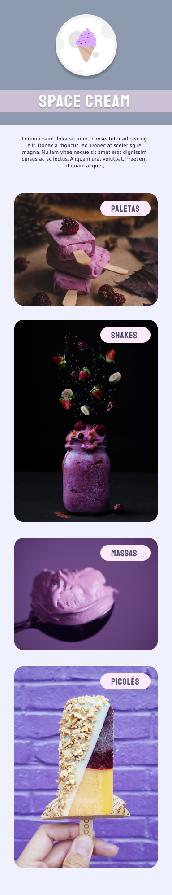

<h1 align="center"> Stage 03 - Space Cream</h1>

 

  

## 🖥️ Tecnologias

Esse projeto foi desenvolvido com as seguintes tecnologias:

- HTML
- CSS
- Git e Github
- Figma

## 📂 Projeto

 A ideia agora é criar o Space Cream, nossa página de sorvetes, levando em consideração o Mobile first! Neste projeto serão exercitados os seguintes pontos:

- Mobile First;
- Unidade de medida flexível;
- Variáveis;
- Animações simples.

 

## 🔖 Layout

Você pode visualizar o layout do projeto através [DESSE LINK](https://www.figma.com/file/drBBktNRdtCIUiN4cZk4yo/Stage-03---Mobile-First/duplicate). É necessário ter conta no [Figma](https://figma.com) para acessá-lo.

  

